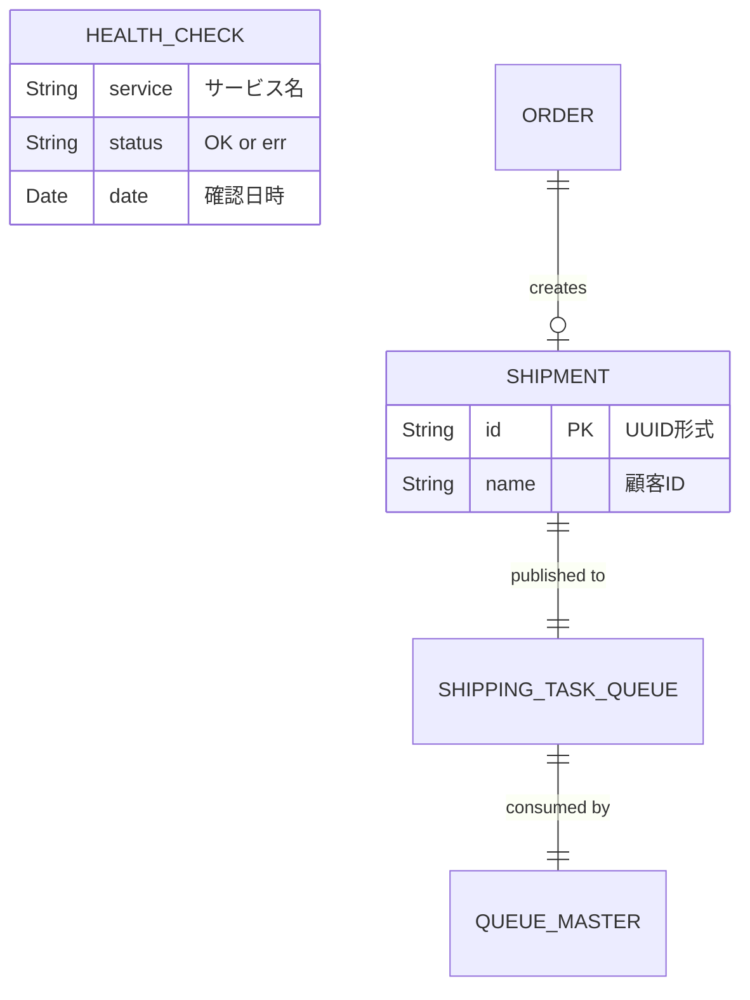
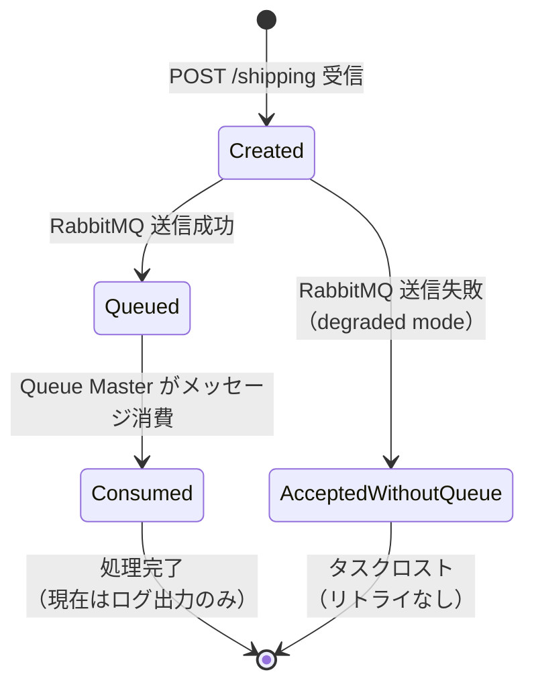
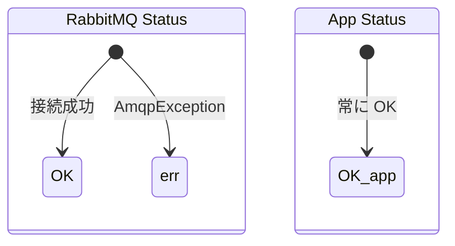

---
source:
  repository: "https://github.com/ulsystems/sockshop-shipping"
  branch: "master"
  commit: "9c0fbfa"
  extracted_at: "2026-03-05T05:16:00Z"
  extractor: "devin"
  external_sources:
    - "https://github.com/ulsystems/sockshop-orders"
    - "https://github.com/ulsystems/sockshop-queue-master"
project:
  name: "sockshop-shipping"
  language: "java"
  framework: "spring-boot"
domains:
  - "shipping"
---

# Shipping（配送）

## 概要

Shipping ドメインは、Sock Shop マイクロサービスアーキテクチャにおける配送機能を担当する。主な責務は以下の通り：

1. **配送タスクの受付**: Orders サービスからの HTTP POST リクエストを受け付け、Shipment エンティティを生成する
2. **配送タスクのキューイング**: 生成した Shipment を RabbitMQ の "shipping-task" キューに投入する
3. **ヘルスチェック**: サービス自身および RabbitMQ 接続の稼働状態を報告する

このサービスはステートレスであり、データベースを持たない。配送情報の永続化は行わず、メッセージキューを介した非同期処理パイプラインの入口として機能する。

## ユースケース一覧

| ユースケース | アクター | 概要 | 対応API/画面 |
|-------------|---------|------|-------------|
| 配送タスク登録 | Orders Service | 注文確定時に顧客IDを含む配送タスクを登録する。Shipment が生成され、RabbitMQ キューに投入される | POST /shipping |
| 配送一覧取得 | （未実装） | 全配送情報の一覧を取得する。現在はスタブ実装（固定文字列を返却） | GET /shipping |
| 配送情報取得 | （未実装） | 指定IDの配送情報を取得する。現在はスタブ実装（固定文字列を返却） | GET /shipping/{id} |
| ヘルスチェック | ロードバランサー / 監視システム | サービスおよび RabbitMQ の稼働状態を確認する | GET /health |
| メトリクス取得 | Prometheus | HTTPリクエストのレイテンシ等のメトリクスを取得する | GET /metrics |

## エンティティ

### Shipment（配送）

**説明**: 配送タスクを表すエンティティ。注文サービスから配送リクエストを受けた際に生成され、RabbitMQ キューに投入される。UUID によって一意に識別される。

**ソースファイル**: `src/main/java/works/weave/socks/shipping/entities/Shipment.java`

#### 属性

| 属性名 | 型 | 説明 | 制約 |
|--------|-----|------|------|
| id | String | 配送タスクの一意識別子 | UUID形式。コンストラクタで自動生成（UUID.randomUUID().toString()）。equals/hashCode の判定基準 |
| name | String | 配送先の顧客ID | Orders サービスから顧客IDが設定される。空文字がデフォルト値 |

#### 関係性



#### ビジネスルール

- **ID自動生成**: Shipment のID は UUID.randomUUID().toString() により自動生成される。外部から指定することも可能（2引数コンストラクタ）
- **同一性判定**: Shipment の等価性は id フィールドのみで判定される（name は等価性に影響しない）
- **デフォルト name**: name を指定しない場合は空文字（""）がデフォルト値として設定される
- **キュー送信の耐障害性**: RabbitMQ への送信が失敗した場合でも、例外をキャッチしてリクエストは正常に受理される（degraded mode）。ただし、この動作はプロダクション環境では推奨されないとコード内コメントで明記されている
- **JSON シリアライゼーション**: メッセージキューへの送信時、Jackson2JsonMessageConverter により JSON 形式にシリアライズされる

### HealthCheck（ヘルスチェック）

**説明**: サービスおよび依存サービスの稼働状態を表す値オブジェクト。ヘルスチェック API のレスポンスとして使用される。

**ソースファイル**: `src/main/java/works/weave/socks/shipping/entities/HealthCheck.java`

#### 属性

| 属性名 | 型 | 説明 | 制約 |
|--------|-----|------|------|
| service | String | チェック対象のサービス名 | "shipping" または "shipping-rabbitmq" |
| status | String | サービスの稼働状態 | "OK"（正常）または "err"（異常） |
| date | Date | ヘルスチェック実行日時 | @JsonFormat(pattern="yyyy-MM-dd'T'HH:mm:ss.SSSXXX") でフォーマット。デフォルトは現在日時 |

#### ビジネスルール

- **RabbitMQ ヘルスチェック**: RabbitTemplate.execute() を用いて RabbitMQ への接続を試行し、サーバープロパティの取得が成功すれば "OK"、AmqpException が発生すれば "err" とする
- **アプリケーションヘルスチェック**: Shipping サービス自身は常に "OK" を返す（API が応答できている時点で正常）
- **レスポンス構造**: ヘルスチェックの結果は `{"health": [HealthCheck, ...]}` の形式で返却される
- **JSON シリアライゼーション**: @JsonIgnoreProperties(ignoreUnknown = true) により、不明なプロパティは無視される

## 状態遷移

### 配送タスクのライフサイクル



| 現在の状態 | イベント | 次の状態 | 備考 |
|-----------|---------|---------|------|
| (初期) | POST /shipping リクエスト | Created | Shipment オブジェクト生成、UUID 自動付与 |
| Created | RabbitMQ 送信成功 | Queued | convertAndSend("shipping-task", shipment) |
| Created | RabbitMQ 送信失敗 | AcceptedWithoutQueue | 例外キャッチ、レスポンスは 201 Created |
| Queued | Queue Master 消費 | Consumed | ShippingTaskHandler.handleMessage() |
| Consumed | 処理完了 | (終了) | 現在はログ出力のみ。docker.spawn() はコメントアウト |
| AcceptedWithoutQueue | - | (終了) | タスクがロストする。リトライ機構なし |

### ヘルスチェックステータス



## APIエンドポイント

| メソッド | パス | 説明 | リクエストボディ | レスポンス | ステータスコード |
|---------|------|------|----------------|-----------|----------------|
| GET | /shipping | 全配送情報の取得（スタブ） | なし | `"GET ALL Shipping Resource."` (String) | 200 OK |
| GET | /shipping/{id} | 指定IDの配送情報取得（スタブ） | なし | `"GET Shipping Resource with id: {id}"` (String) | 200 OK |
| POST | /shipping | 配送タスクの登録 | `{"id": "string", "name": "string"}` (Shipment JSON) | `{"id": "uuid", "name": "string"}` (Shipment JSON) | 201 Created |
| GET | /health | ヘルスチェック | なし | `{"health": [{"service": "string", "status": "string", "date": "datetime"}, ...]}` | 200 OK |
| GET | /metrics | Prometheusメトリクス | なし | Prometheus exposition format | 200 OK |

### POST /shipping 詳細

**リクエスト例**:
```json
{
  "name": "57a98d98e4b00679b4a830af"
}
```
※ `id` は省略可能（サーバー側で UUID が自動生成される）。Orders サービスからは顧客IDが `name` フィールドに設定される。

**レスポンス例**:
```json
{
  "id": "3f1a5e7c-8b2d-4f9e-a1c3-d5e7f9b1c3d5",
  "name": "57a98d98e4b00679b4a830af"
}
```

### GET /health 詳細

**レスポンス例（正常時）**:
```json
{
  "health": [
    {
      "service": "shipping-rabbitmq",
      "status": "OK",
      "date": "2026-03-05T05:16:00.000+00:00"
    },
    {
      "service": "shipping",
      "status": "OK",
      "date": "2026-03-05T05:16:00.000+00:00"
    }
  ]
}
```

**レスポンス例（RabbitMQ異常時）**:
```json
{
  "health": [
    {
      "service": "shipping-rabbitmq",
      "status": "err",
      "date": "2026-03-05T05:16:00.000+00:00"
    },
    {
      "service": "shipping",
      "status": "OK",
      "date": "2026-03-05T05:16:00.000+00:00"
    }
  ]
}
```

## ドメインルール

### メッセージキュー設定

- **キュー名**: `shipping-task`（非永続キュー: `durable = false`）
- **エクスチェンジ名**: `shipping-task-exchange`（TopicExchange）
- **ルーティングキー**: `shipping-task`（キュー名と同一）
- **メッセージ形式**: Jackson2JsonMessageConverter による JSON シリアライゼーション
- **接続設定**:
  - ホスト: `spring.rabbitmq.host` プロパティ（デフォルト: `rabbitmq`）
  - ポート: デフォルト（5672）
  - ユーザー名: `guest`（ハードコード）
  - パスワード: `guest`（ハードコード）
  - 接続タイムアウト: 5000ms
  - クローズタイムアウト: 5000ms

### 分散トレーシング設定

- **Zipkin URL**: `http://{zipkin_host}:9411/`（デフォルトホスト: `zipkin`）
- **有効/無効**: `spring.zipkin.enabled` プロパティ（デフォルト: `false`）
- **サンプリング率**: 100%（`spring.sleuth.sampler.percentage=1.0`）

### メトリクス設定

- **メトリクスパス**: `/metrics`（Prometheus simpleclient_servlet）
- **収集項目**:
  - Spring Boot メトリクス（SpringBootMetricsCollector）
  - JVMホットスポットメトリクス（DefaultExports）
  - HTTPリクエストレイテンシ（request_duration_seconds ヒストグラム）
    - ラベル: service, method, route, status_code

### サーバー設定

- **ポート**: `${port:8080}`（環境変数 `port` またはデフォルト 8080）
- **Spring Actuator**: health エンドポイント無効（`endpoints.health.enabled=false`）、metrics エンドポイント無効（`endpoints.metrics.enabled=false`）
- **アプリケーション名**: `shipping`

## Gap分析（設計と実装の乖離）

### Gap 1: GET API がスタブ実装

- **内容**: `GET /shipping` および `GET /shipping/{id}` は固定文字列を返すスタブ実装であり、実際の配送情報を取得する機能が実装されていない
- **影響範囲**: 配送情報の照会機能。ただし、他サービスからこれらの API を呼び出している箇所は確認されていない
- **重要度**: 中（現在の Sock Shop デモでは使用されていないが、API として公開されている以上は実装が期待される）

### Gap 2: データ永続化なし

- **内容**: Shipment エンティティに対するリポジトリ層（データベース永続化）が存在しない。これにより GET API の実装も不可能な状態である
- **影響範囲**: 配送情報の永続化・照会全般
- **重要度**: 中（設計上はメッセージキューへの投入がメインの責務であり、永続化は Queue Master 側の責務とも解釈できる）

### Gap 3: ログ出力方式

- **内容**: `ShippingController` の `postShipping` メソッドで `System.out.println` を使用しており、SLF4J 等のロギングフレームワークを使用していない
- **影響範囲**: 運用時のログ管理・レベル制御・構造化ログ出力
- **重要度**: 中

### Gap 4: RabbitMQ 認証情報のハードコード

- **内容**: `RabbitMqConfiguration` で RabbitMQ のユーザー名・パスワードが `guest/guest` でハードコードされている
- **影響範囲**: セキュリティ。プロダクション環境では環境変数や外部設定サービスでの管理が必要
- **重要度**: 高

### Gap 5: バリデーションの欠如

- **内容**: `POST /shipping` で受け取る Shipment オブジェクトに対するバリデーション（name の必須チェック、空文字チェック等）が実装されていない
- **影響範囲**: 不正なデータがキューに投入される可能性
- **重要度**: 中
