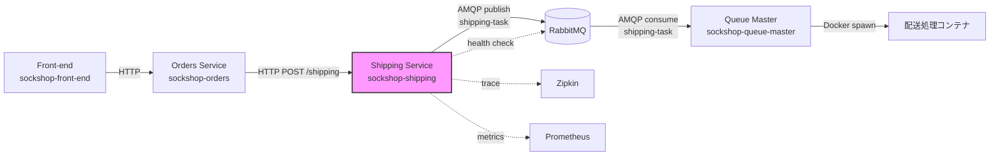
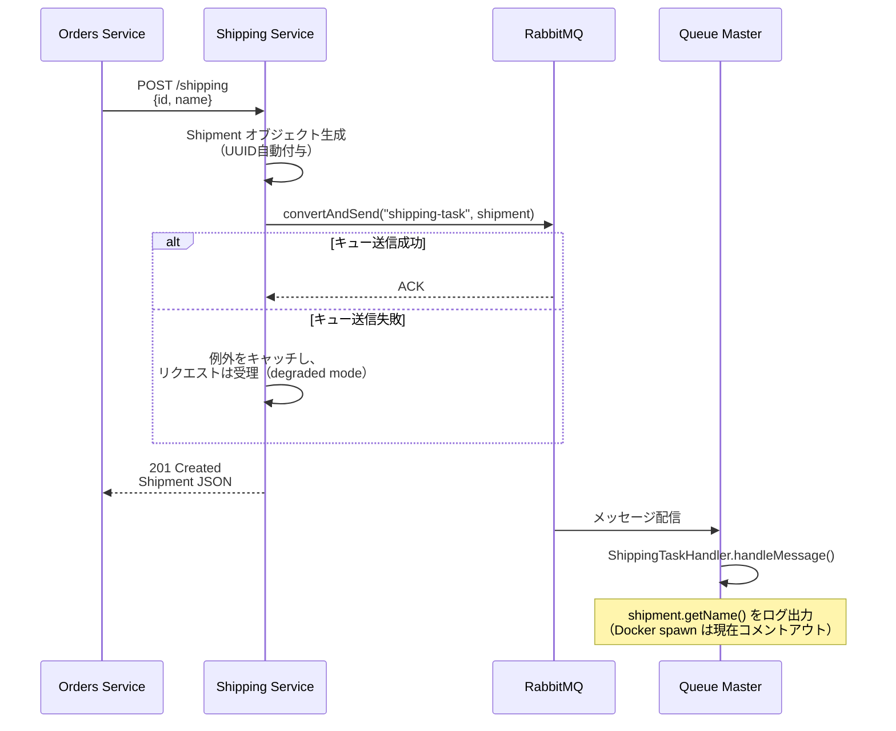
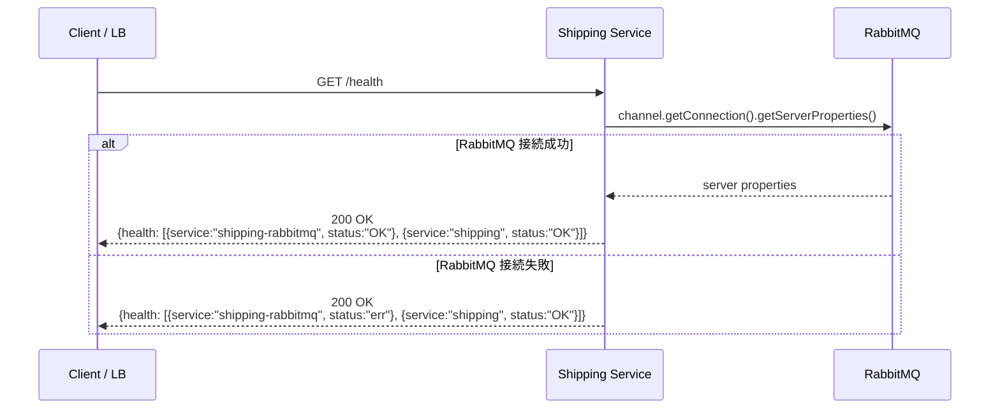

---
source:
  repository: "https://github.com/ulsystems/sockshop-shipping"
  branch: "master"
  commit: "9c0fbfa"
  extracted_at: "2026-03-05T05:16:00Z"
  extractor: "devin"
  external_sources:
    - "https://github.com/ulsystems/sockshop-orders"
    - "https://github.com/ulsystems/sockshop-queue-master"
project:
  name: "sockshop-shipping"
  language: "java"
  framework: "spring-boot"
domains:
  - "shipping"
---

# Domain Knowledge Index

> このドキュメントはコードベースから自動抽出されたドメイン知識です。
> 最終更新: 2026-03-05T05:16:00Z

## ドメイン全体像

Sock Shop Shipping サービスは、マイクロサービスデモアプリケーション「Sock Shop」の配送機能を担当するサービスである。注文サービス（orders）から配送リクエストを受け取り、配送タスクを RabbitMQ メッセージキューに投入する役割を持つ。キューに投入されたタスクは、別サービス（queue-master）が消費し、実際の配送処理（Dockerコンテナのスポーン等）を実行する。

このサービスは REST API を公開し、配送情報の取得・作成およびヘルスチェック機能を提供する。サービス自体はステートレスであり、永続化層（データベース）を持たない。配送タスクの非同期処理を RabbitMQ を介して実現している。

### アーキテクチャ概要

- **バックエンド**: Java 1.8 / Spring Boot 1.4.0 / なし（データベース未使用）
- **フロントエンド**: なし（APIサービスのみ）
- **メッセージキュー**: RabbitMQ（AMQP プロトコル）
- **分散トレーシング**: Zipkin（Spring Cloud Sleuth 経由）
- **メトリクス**: Prometheus（simpleclient）
- **コンテナ**: Docker（weaveworksdemos/msd-java:jre-latest ベースイメージ）
- **CI/CD**: GitHub Actions / Travis CI（レガシー）

### サービスアーキテクチャ図

### 主要業務フロー

#### 配送タスク登録フロー

#### ヘルスチェックフロー

## アクター一覧

| アクター | 説明 | 主な操作 |
|---------|------|---------|
| Orders Service | 注文処理時に配送リクエストを送信する内部マイクロサービス。顧客IDを name フィールドとして Shipment を作成する | POST /shipping |
| Queue Master | RabbitMQ キューから配送タスクを消費し、実際の配送処理を行う内部マイクロサービス | shipping-task キュー消費 |
| ロードバランサー / 監視システム | サービスの死活監視を行うインフラコンポーネント | GET /health |
| Prometheus | メトリクス収集基盤。/metrics エンドポイントからメトリクスをスクレイプする | GET /metrics |

## サブドメイン一覧

| サブドメイン | 概要 | 主要エンティティ |
|-------------|------|-----------------|
| Shipping（配送） | 配送タスクの受付・キューイングおよびサービスヘルスチェックを管理する | Shipment, HealthCheck |

## DDD分類

| クラス名 | DDD分類 | 理由 |
|---------|---------|------|
| Shipment | エンティティ（集約ルート） | UUID形式のIDを持ち、独自のライフサイクル（生成→キュー投入→消費）を持つ。配送ドメインにおける中心的な概念であり、他のサービスから参照される |
| HealthCheck | 値オブジェクト | IDを持たず、service/status/date の組み合わせで特定される。ヘルスチェックのレスポンスとして一時的に生成され、永続化されない |
| ShippingController | アプリケーションサービス | REST APIのエントリポイントとして、ユースケースの調整（Shipment生成→キュー投入）を行う |
| RabbitMqConfiguration | インフラストラクチャ | メッセージキューの接続・キュー定義・エクスチェンジ設定を担当するインフラ層の設定クラス |
| PrometheusAutoConfiguration | インフラストラクチャ | メトリクス収集のためのPrometheus設定を行うインフラ層の設定クラス |
| WebMvcConfig | インフラストラクチャ | HTTPリクエストの監視インターセプタを登録するインフラ層の設定クラス |
| HTTPMonitoringInterceptor | インフラストラクチャ | HTTPリクエストのレイテンシをPrometheusメトリクスとして記録するインフラ層のミドルウェア |
| ShippingServiceApplication | インフラストラクチャ | Spring Bootアプリケーションのエントリポイント |

## SDLC向けドメイン知識充足度

### 要件定義

| 項目 | 状態 | 備考 |
|------|------|------|
| ユースケース網羅性 | △ 部分的 | REST APIエンドポイントから主要ユースケースは特定可能だが、GET /shipping および GET /shipping/{id} はスタブ実装のみ（文字列を返すだけ） |
| ビジネスルール列挙 | △ 部分的 | キュー送信失敗時の graceful degradation ルールはコードから特定可能。配送料金計算は orders サービス側にハードコード（4.99F） |
| 非機能要件 | △ 部分的 | RabbitMQ接続タイムアウト（5000ms）、サーバーポート（8080）は設定から特定可能。SLAやスループット要件は不明 |

### 設計

| 項目 | 状態 | 備考 |
|------|------|------|
| 集約境界の明確さ | △ 部分的 | Shipment が集約ルートであることは明確だが、DBを持たないため永続化境界が不明瞭 |
| API契約 | △ 部分的 | リクエスト/レスポンス形式はコードから特定可能だが、正式なAPI仕様書（OpenAPI等）が存在しない |
| サービス間相互作用図 | △ 部分的 | 外部リポジトリ調査により再構成可能だが、公式なアーキテクチャ図は存在しない |

### コーディング

| 項目 | 状態 | 備考 |
|------|------|------|
| 例外処理パターン | △ 部分的 | キュー送信失敗時に例外をキャッチして処理を継続するパターンが確認できるが、System.out.println によるログ出力であり、適切なロギングフレームワーク（SLF4J等）を使用していない |
| バリデーション実装 | ✗ 未抽出 | Shipment に対するバリデーション（name の必須チェック等）が実装されていない |
| フレームワーク固有の設定 | ✓ 抽出済み | application.properties、RabbitMQ設定、Prometheus設定等を確認済み |

### 結合テスト

| 項目 | 状態 | 備考 |
|------|------|------|
| 正常・例外シナリオの網羅 | △ 部分的 | ITShippingController にて正常系5ケース（GET, GET by ID, POST, Health, Queue down時のPOST）が確認できる |
| 外部サービスのタイムアウト・SLA | ✗ 未抽出 | RabbitMQ接続タイムアウトは設定されているが、E2Eレベルでのタイムアウトテストは確認できない |
| テストデータ仕様 | △ 部分的 | テストコードから Shipment("someName") 等の簡易テストデータは確認可能だが、包括的なテストデータ仕様は存在しない |

### 設計と実装の乖離（Gap分析）

| Gap | 内容 | 影響範囲 | 重要度 |
|-----|------|---------|--------|
| GET APIスタブ | GET /shipping, GET /shipping/{id} は文字列を返すスタブ実装であり、実際の配送情報を返さない | 配送情報の照会機能が未実装 | 中 |
| ログ出力方式 | System.out.println を使用しており、SLF4J/Logback 等のフレームワークを使用していない | 運用時のログ管理・レベル制御が困難 | 中 |
| 認証情報ハードコード | RabbitMQ の認証情報（guest/guest）がソースコードにハードコードされている | セキュリティリスク。環境変数や外部設定での管理が望ましい | 高 |
| Queue Master の Docker spawn | ShippingTaskHandler 内の docker.init()/docker.spawn() がコメントアウトされている | 実際の配送処理が実行されない | 高 |
| サービス名不一致 | HTTPMonitoringInterceptor のデフォルトサービス名が "orders" になっている（spring.application.name のデフォルト値） | Prometheus メトリクスのサービスラベルが正しく設定されない可能性がある（ただし application.properties で "shipping" が設定されているため実運用では問題なし） | 低 |

## 詳細ドキュメント

- [用語集](./glossary.md)
- ドメイン詳細
  - [Shipping（配送）](./domains/shipping.md)
